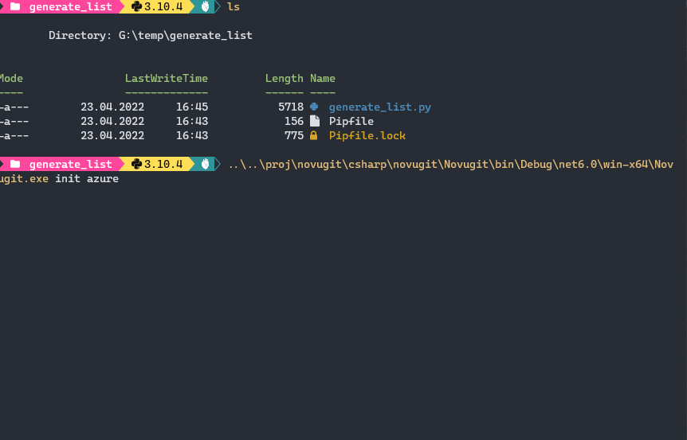

# novugit

Initialize GIT repository in a folder.

This application automates the manual steps most of the people do when creating new repositories

- initialize the local repository by running `git init`
- create a remote repository, for example on GitHub, Gitlab or Azure - typically by leaving the command line and firing up a web browser
- add the remote
- create a `.gitignore` file (either using something like [https://gitignore.io](https://gitignore.io) or by copying their very own custom one)
- append to `.gitignore` files already in folder (you can choose which ones)
- create some config files (e.g. `.eslintrc`, `.tslintrc`, `.prettierrc`) [not implemented yet]
- add your project files
- commit the initial set of files
- push up to the remote repository

## DISCLAIMER

This is a personal project, currently in early development stage. <br>
It is NOT ready for public use and is provided AS-IS without any warranties. Use at your own risk.

## Installation

TBD once app is usable

## Usage

- From folder where you want to create a repo run:

```sh
novugit init github
# -or-
novugit init github --repo-name myrepo --description "This is my awesome repo"
```

## Showcase (from unfinished version)



## TODO

- Implement other repositories
  - [x] Gitlab (no good sdk for .net, will need to write own implementation)
  - [x] BitBucket (optional as I am not using it)
  - [x] Azure DevOps
  - [x] Gitea
  - [x] Forgejo
- [ ] Add other config files with sane defaults
- [ ] Add build system (GitHub actions?)
- Quality control
  - [x] Check if all errors are properly handled
  - [x] Check if output messages make sense
  - [x] Encrypt tokens in config file
- [ ] Add tests
- [ ] Publish (scoop? Chocolatey? nuget?)
- And more ideas???
  - [ ] add config functionality for setting "presets" or defaults
  - [ ] add dynamic config files creation (maybe place configs in some folder and they will get picked up by application)
